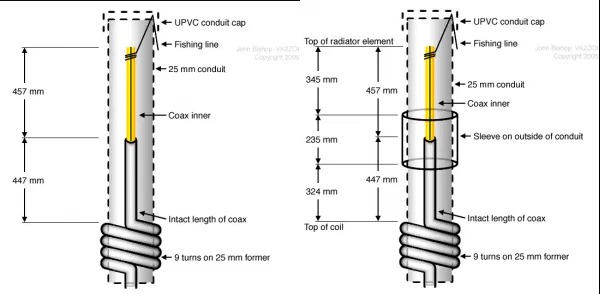

Acredito que a construção de uma antena flower pot seja um dos primeiros projetos DIY de todo radioamador.
Essa antena tem um excelente custo x benefício, pois consegue entregar um bom resultado e nós gastamos bem pouco para constuir.

Hoje você vai me acompanhar na construção da minha primeira flower pot, se você já tem experiência com a construção de antenas provavelmente vai ver erros que cometi e, para quem está começando, assim como eu, espero conseguir auxiliar de alguma forma!

## Materiais:

Abaixo está a lista de todos materiais que utilizei para a construção da antena:
- 1 metro (ou mais) de cano de pvc 3/4
- cap para o cano de pvc
- conector tipo t para cano de pvc
- cabo coaxial rg58 50 ohms
- ferro de solda
- estanho para solda
- fita métrica
- fita hellerman
- linha de pesca
- alicate
- conector UHF macho
- adaptador SMA fêmea x UHF fêmea
- fita isolante

## Construção da antena

Abaixo está o esquema de construção da flower pot, a imagem ao lado esquerdo é para rx/tx somente em 2m e a imagem à direita é para rx/tx em 2m e 70cm:

Começamos então com a parte para descascar o cabo, nesse momento retiramos a proteção e a malha, deixando somente a parte central do cabo, nessa etapa você deve deixar com o comprimento de 457mm:

A outra parte do cabo que deve ficar intacta deve ter o comprimento de 447mm:

Onde estiver o limite de 447mm faça uma marcação para saber à partir de qual ponto o cabo deve ficar dentro do cano de pvc e onde começa a bobina que você irá fazer posteriormente:

Agora você deve fazer um furo no cabo de pvc por onde irá inserir o cabo, após ter inserido o cabo você deve amarrar a linha de pesca na ponta para que a mesma segure o cabo dentro do cano de pvc, então deixe um pouco da linha para fora e feche com o cap.
Para facilitar, faça um pequeno corte no pvc para conseguir prender a linha, dessa forma não corre o risco de estourar a linha ao colocar o cap:

Logo após basta fechar com o cap, dessa forma o cabo ficará seguro dentro do pvc:

Agora vamos fazer a bobina, à partir do furo feito no pvc, onde foi inserido o cabo coaxial, você irá fazer a bobina, ela deve ter 9 voltas, dê as nove voltas para saber onde irá finalizar e então nesse ponto faça um novo furo no pvc para passar o cabo para dentro do cano.
Com a bobina pronta, passe fita isolante em volta para proteção, dessa forma pode-se garantir uma maior durabilidade para o cabo que ficará exposto. Lembrando que a parte da bobina deve ser feita de uma forma que o cabo fique bem seguro e uma volta próxima à outra.

Após passar o cabo por dentro do cano pvc, você pode optar por deixar o cabo sair pelo próprio cano, ou então adicionar um t, dessa forma o cabo pode sair por um lado do t e a outra ponta ficar disponível para fixar a antena de alguma base, essa parte fica à sua escolha, veja o que melhor se adequa à sua situação.
Nesse momento você também deve optar pela tamanho do cabo que vai deixar para conectar ao seu rádio e então cortá-lo.

Na ponta do cabo você deve colocar e soldar o conector UHF macho, existem vários modelos de conectores, então sugiro verificar como deve ser feito com o conector que você adquiriu. Abaixo estão as instruções de montagem para o conector que utilizei:

E aqui temos a antena pronta:

Caso queira, nesse [link](https://vk2zoi.com/articles/half-wave-flower-pot/) também tem um bom tutorial de construção da antena (em inglês).

Logo abaixo estão dois vídeos tutoriais que também utilizei na montagem da antena:

  

  