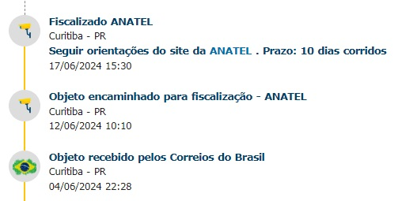
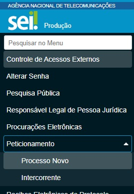

## Meu rádio foi para a fiscalização da Anatel e agora?

Com certeza muitos de vocês já passaram ou vão passar por isso:

Isso pode até assustar algumas pessoas, pensando que perderam o rádio ou que podem ter arranjado um problema junto a Anatel, mas não se preocupe, os trâmites são simples, porém exigem **paciência**, pois mesmo que seja algo simples, ele é bem demorado.

No site da Anatel existe uma página que trata sobre [Importação para Uso Próprio](https://www.gov.br/anatel/pt-br/regulado/certificacao-de-produtos/importacao-para-uso-proprio).

## Abrir um processo no SEI

Primeiramente você deve acessar o [SEI](https://sei.anatel.gov.br/sei/controlador_externo.php?acao=usuario_externo_logar&id_orgao_acesso_externo=0) e abrir um processo no menu Processo novo:

Busque pelo tipo de processo **Certificação de Produto: Declaração de Conformidade - Importado uso Próprio**, no formulário de *Declaração de Conformidade* já junto ao processo você deve preencher os dados necessários, atente-se ao informar o modelo do rádio e também o código de rastreio dos Correios, isso é muito importante. Porém, nessa etapa não é necessário informar o Número de Série do rádio, porém como não temos ele em mãos, não é possível informar o mesmo, esse dado pode ser deixado em branco ou então informe que ainda não possue o equipamento em mãos, porque ainda não o recebeu.

Após finalizar o preenchimento da declaração você deve anexar ao processo os documentos solicitados nos itens *2.3*, *2.4* e *2.5* do formulário, esses dados podem ser obtidos no site da [FCC](https://apps.fcc.gov/oetcf/eas/reports/GenericSearch.cfm?calledFromFrame=N) órgão similar à ANATEL nos EUA, caso tenha dificuldades para realizar a pesquisa diretamente pelo site da FCC você pode fazer a pesquisa no Google utilizando "fcc modelo do rádio", por exemplo, *fcc baofeng uv-5r* e já ter o retorno com a página referente ao equipamento, no caso do exemplo o [UV-5R](https://fcc.report/FCC-ID/2AJGM-UV5R).

Com o cadastro do processo no SEI finalizado, envie o número do processo e código de rastreio para o e-mail da cidade onde o equipamento encontra-se retido:
- Curitiba: documentacao.pr@anatel.gov.br
- São Paulo: documentacao.sp@anatel.gov.br
- Rio de Janeiro: documentacao.rj@anatel.gov.br

Agora é aguardar o retorno da Anatel, pode ser que solicitem mais informações caso seja necessário, ou então vão solicitar que você envie um termo de compromisso assinado onde você se compromete a enviar o número de série do equipamento assim que o receber em casa. Esse termo de compromisso pode ser assinado digitalmente, caso tenha uma conta no gov.br, você pode acessar o serviço de assinatura eletrônica clicando [AQUI](https://www.gov.br/governodigital/pt-br/identidade/assinatura-eletronica).
Para enviar o termo de compromisso basta acessar o SEI, clicar em *Peticionamento > Intercorrente* e informar o código do processo e então anexar o termo de compromisso.
Com isso feito basta aguardar o envio do rádio.

Apenas para lembrar, todo esse processo pode ser bem demorado, levando em média 60 dias. Por experiência própria, desde a abertura do processo no SEI até receber o equipamento em casa foram quase 90 dias.
Então aqui fica uma dica, no caso de você ler esse post antes de efetuar uma compra internacional, caso tenha pressa ou não queira esperar e ter que realizar todos esses trâmites, procure comprar um rádio que já esteja no Brasil, pois assim irá economizar um bom tempo de espera.